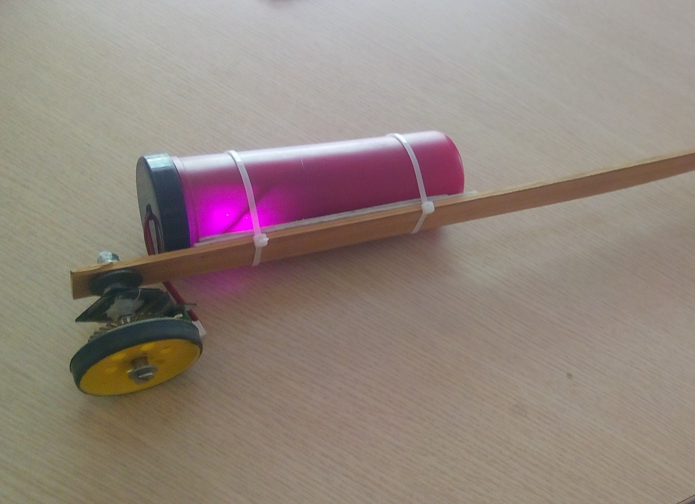

# Introduction to Engineering Design Project
## Digimeter - Modernizing Measurement

We designed and fabricated a hand-held digital measuring device integrated with an Android App to measure lengths, areas and volumes of day to day objects. We built this using Arduino Nano, Bluetooth Module and Wheel Encoder.

